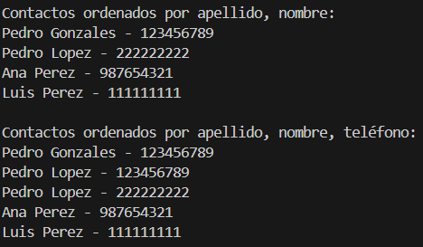

+# Practica Sets

## 📌 Información General

- **Título**: Práctica Sets
- **Asignatura**: Estructura de Datos
- **Carrera**: Computación
- **Estudiante**: Mateo Sebastián Morejón Delgado
- **Fecha**: 05/06/2025
- **Profesor**: Ing. Pablo Torres

---

# Ejercicios con Sets en Java

Este proyecto contiene la implementación de algoritmos para trabajar con colecciones `Set` en Java, específicamente `HashSet`, `LinkedHashSet` y `TreeSet`. Los ejercicios están diseñados para practicar el uso de estas estructuras de datos sin utilizar listas u otras colecciones.

---

## 🧠 Ejercicio 01: Ordenar un Stack en orden ascendente (con `HashSet` y `TreeSet`)

En este ejercicio, se implementa un algoritmo para ordenar elementos en una estructura de tipo `Set` y manipular la forma en que los elementos se almacenan.

### ✅ Ejemplo:
**Entrada**:  
`(tope) 5 -> 1 -> 4 -> 2`  
**Salida esperada**:  
`(tope) 1 -> 2 -> 4 -> 5`

#### **Detalles**:
- Se utiliza el `HashSet` para guardar los elementos sin duplicados y sin mantener un orden.
- Luego, se utiliza el `TreeSet` para organizar los elementos de manera ordenada (ascendente por defecto).

---

## 🧠 Ejercicio 02: Ordenar un Stack en orden descendente (opcional)

En este ejercicio se ajusta la lógica del ejercicio anterior para ordenar los elementos de manera descendente utilizando un `TreeSet` con un comparador.

### ✅ Ejemplo:
**Entrada**:  
`(tope) 5 -> 1 -> 4 -> 2`  
**Salida esperada**:  
`(tope) 5 -> 4 -> 2 -> 1`

#### **Detalles**:
- Similar al ejercicio anterior, pero se utiliza un comparador en el `TreeSet` para invertir el orden y así obtener un orden descendente.

---

### 💡 Instrucciones de Ejecución

Para ejecutar los ejercicios:

1. **Compila y ejecuta las clases** `StackSorterAscendente` y `StackSorterDescendente`.
2. El código implementa dos soluciones:
   - **StackSorterAscendente**: Ordena el conjunto en orden ascendente usando `TreeSet`.
   - **StackSorterDescendente**: Ordena el conjunto en orden descendente usando `TreeSet` con un comparador personalizado.

#### **Clases utilizadas**:
- `Sets`: Clase principal donde se encuentran los métodos para crear y ordenar los sets.
  - **Métodos**:
    - `construirHashSet()`: Crea un `HashSet` y muestra los elementos sin orden.
    - `construirLinkedHashSet()`: Crea un `LinkedHashSet` y mantiene el orden de inserción.
    - `construirTreeSet()`: Crea un `TreeSet` y organiza los elementos en orden ascendente.
    - `construirTreeSetConComparador()`: Crea un `TreeSet` con un comparador que permite ordenar los elementos en orden descendente.

---

## 🖼️ Captura de pantalla

Aquí puedes agregar una captura de pantalla del resultado de la ejecución de los ejercicios:

En este ejercicio, se implementa un algoritmo para ordenar elementos en una estructura de tipo `Set` y manipular la forma en que los elementos se almacenan.

### ✅ Ejemplo:
**Entrada**:  
`(tope) 5 -> 1 -> 4 -> 2`  
**Salida esperada**:  
`(tope) 1 -> 2 -> 4 -> 5`

#### **Detalles**:
- Se utiliza el `HashSet` para guardar los elementos sin duplicados y sin mantener un orden.
- Luego, se utiliza el `TreeSet` para organizar los elementos de manera ordenada (ascendente por defecto).

---

## 🧠 Ejercicio 02: Ordenar un Stack en orden descendente (opcional)

En este ejercicio se ajusta la lógica del ejercicio anterior para ordenar los elementos de manera descendente utilizando un `TreeSet` con un comparador.

### ✅ Ejemplo:
**Entrada**:  
`(tope) 5 -> 1 -> 4 -> 2`  
**Salida esperada**:  
`(tope) 5 -> 4 -> 2 -> 1`

#### **Detalles**:
- Similar al ejercicio anterior, pero se utiliza un comparador en el `TreeSet` para invertir el orden y así obtener un orden descendente.

---

### 💡 Instrucciones de Ejecución

Para ejecutar los ejercicios:

1. **Compila y ejecuta las clases** `StackSorterAscendente` y `StackSorterDescendente`.
2. El código implementa dos soluciones:
   - **StackSorterAscendente**: Ordena el conjunto en orden ascendente usando `TreeSet`.
   - **StackSorterDescendente**: Ordena el conjunto en orden descendente usando `TreeSet` con un comparador personalizado.

#### **Clases utilizadas**:
- `Sets`: Clase principal donde se encuentran los métodos para crear y ordenar los sets.
  - **Métodos**:
    - `construirHashSet()`: Crea un `HashSet` y muestra los elementos sin orden.
    - `construirLinkedHashSet()`: Crea un `LinkedHashSet` y mantiene el orden de inserción.
    - `construirTreeSet()`: Crea un `TreeSet` y organiza los elementos en orden ascendente.
    - `construirTreeSetConComparador()`: Crea un `TreeSet` con un comparador que permite ordenar los elementos en orden descendente.

---

## 🖼️ Captura de pantalla

Aquí puedes agregar una captura de pantalla del resultado de la ejecución de los ejercicios:

)

---

## 💻 Créditos

Desarrollado como parte de ejercicios de práctica en la asignatura **Estructura de Datos**.

---

### Notas adicionales:
- **`HashSet`**: No garantiza el orden de los elementos.
- **`LinkedHashSet`**: Mantiene el orden de inserción de los elementos.
- **`TreeSet`**: Organiza los elementos de manera ascendente (por defecto) o descendente (utilizando un comparador).
)

---

## 💻 Créditos

Desarrollado como parte de ejercicios de práctica en la asignatura **Estructura de Datos**.

---

### Notas adicionales:
- **`HashSet`**: No garantiza el orden de los elementos.
- **`LinkedHashSet`**: Mantiene el orden de inserción de los elementos.
- **`TreeSet`**: Organiza los elementos de manera ascendente (por defecto) o descendente (utilizando un comparador).
